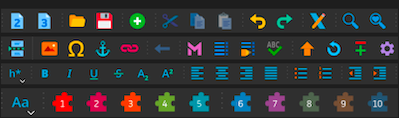
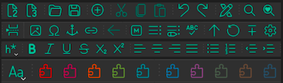
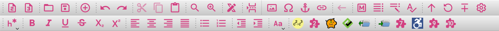
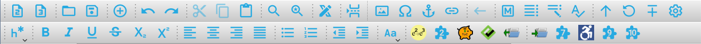

Alternative Sigil-Ebook Icon Themes
======================

Sigil is a free, open source, multi-platform ebook editor that uses
Qt (and QtWebEngine). It is designed to edit books in ePub format
(both ePub 2 and ePub 3).

This repository holds the primary user interface icons used by Sigil
in icon sets referred to as "themes".  Users of Sigil can choose to
use one of the three primary icon themes provided with Sigil:

- [Main](https://github.com/Sigil-Ebook/Sigil/tree/master/src/Resource_Files/main) - Default set available in Sigil 1.0 and later:
     - 
     - 

- [Fluent](https://github.com/microsoft/fluentui-system-icons) - icons derived from Microsoft's fluent icon set
     - 
     - 
     
- [Material](https://github.com/google/material-design-icons) - icons derived from Google's material icons:
     - 
     - 

In addition to these 3 main supported icon themes, Sigil allows
users to install their own custom icon theme after compiling
them with Qt's Resource Compiler to generate .rcc files.

Custom Icon Theme
=================
To help users find possible custom icon themes, we have
created some additional derived icon themes that Sigil
users may decide to install themselves:

- Legacy - pure svg versions of Sigil's icons pre Sigil v0.9.7.
     - 

- Material Derivatives, each in one of the following
base colours: blue, gray, lilac, orange, pink, and red
specifically chosen to be usable under both Light and Dark modes.
     - 
     - 
     - 
     - 
     - 
     - 

See this repo's Releases to download the .rcc icon theme of your
choice.

Installing a .rcc icon Theme into Sigil
=======================================

1. Download one of the .rcc files from Releases
2. Rename it to "custom_icon_theme.rcc"
3. Copy that file to your Sigil user preferences Folder:
      - On macOS: "~/Library/Application Support/sigil-ebook/sigil/"
      - On Windows: "%localappdata%\sigil-ebook\sigil\
      - On Linux: "~/.local/share/sigil-ebook/sigil\"

An easier way to find your Sigil user preferences folder is to
launch Sigil and navigate to the Preferences menu item.
Once Preferences opens, you will see a button to
"Open Preferences Location" in the bottom left corner
of the Preferences dialog.

Clicking this button should open a Window showing this folder.
Drag and drop the .rcc file here.

Once installed.  Fire Up Sigil and go to
Preferences->Appearance and select the Icon Themes tab.
Make your selection and restart Sigil.

Creating Your Own Icon Theme
============================

More advanced users who are familiar with svg editing
(Inkscape, etc) and have Qt installed (for its resource
compiler, rcc) can create a complete set of icons
matching the names provided in the src/main/folder here.

You can use the command line to run rcc:
rcc -binary -o PATH_TO_OUTPUT_FILE.RCC PATH_TO_QRC_FILE

See the Qt docs on rcc for your version of Qt:
https://doc.qt.io/qt-5/rcc.html