# Sigil Icon Themes

Regrettably, the free and multi-platform ebook editor **[Sigil](https://github.com/Sigil-Ebook/Sigil)** offers only a limited selection of user interface icon themes. Acknowledging the diverse preferences of users, this repository aims to expand those options by curating a collection of icon sets. And for those seeking a unique look, a detailed guide for crafting a custom icon set with a Python script is provided.

## Primary Icon Themes

**Sigil** comes installed with three icon themes:

- **[Main](https://github.com/Sigil-Ebook/Sigil/tree/master/src/Resource_Files/main)**: The default icon set available in Sigil v1.0 and later.
     - 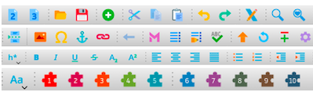
     - 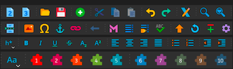
- **[Fluent](https://github.com/microsoft/fluentui-system-icons)**: A collection of icons inspired by Microsoft's Fluent icon set.
     - 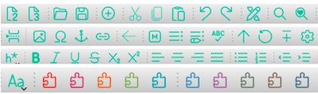
     - 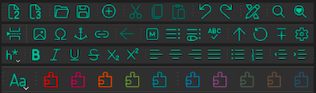
- **[Material](https://github.com/google/material-design-icons)**: A set of icons based on Google's Material icon set.
     - 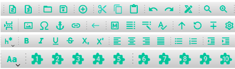
     - 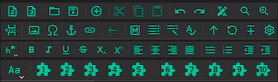

To change the icon theme, access the Preference popup menu by selecting `Preference` from the `Edit` menu on the menu bar. Within the popup's sidebar, ensure `Appearance` is selected, then click on the `Icon Themes` tab.

After selecting the preferred theme, restart Sigil for the changes to take effect.

## Material Icons Derivatives

 https://github.com/JedWag/

https://github.com/JedWag/sigil-gui-icons/tree/master/releases

This repository offers the following additional icon sets:

- [Legacy Theme](./releases/): a versions of Sigil's icons pre Sigil v0.9.7.
     - 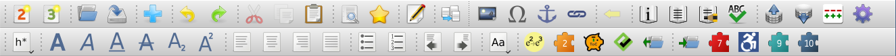
- **Material Derivative Themes**: a spectrum of icon themes, specifically chosen to be usable under both Light and Dark modes.
     - *Red* 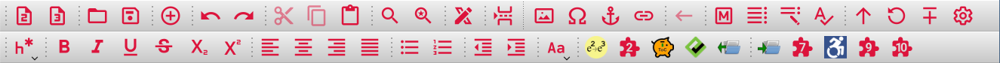
     - *Orange* 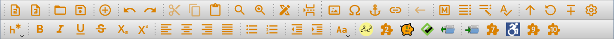
     - *Pink* 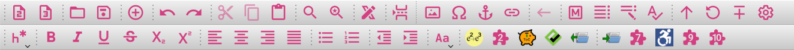
     - *Gray* 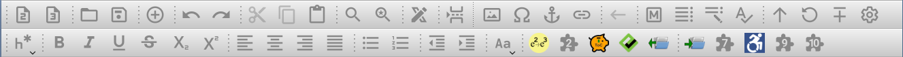
     - *Lilac* 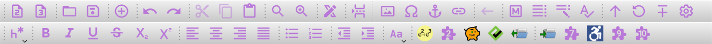
     - *Blue* 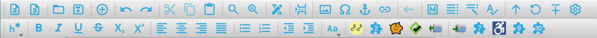

To obtain any of these custom themes, visit the repository's Releases section and download the desired .rcc icon theme file.

## Custom Icon Themes

## How to Install a Custom Icon Theme in Sigil

To install a custom icon theme:

1. Acquire the .rcc file from the Releases section.
2. Rename the file to "custom_icon_theme.rcc."
3. Place the renamed file into the Sigil preferences directory specific to your operating system.

Download one of the .rcc files from Releases
Rename it to "custom_icon_theme.rcc"
Copy that file to your Sigil user preferences Folder:
On macOS: "~/Library/Application Support/sigil-ebook/sigil/"
On Windows: "%localappdata%\sigil-ebook\sigil\
On Linux: "~/.local/share/sigil-ebook/sigil"

For quick access to the Sigil preferences directory, open Sigil, head to the Preferences menu, and use the "Open Preferences Location" button found in the Preferences dialog's lower-left corner.

After installation, launch Sigil, navigate to Preferences > Appearance, select the Icon Themes tab, choose your new theme, and restart Sigil to apply the changes.

## Crafting Your Personal Icon Theme

Tech-savvy users with a knack for SVG editing and Qt's resource compiler (rcc) can design a unique set of icons. Follow the naming conventions outlined in the src/main/folder and use the rcc command line tool to compile your theme:

Beyond the primary themes, Sigil also accommodates the integration of custom icon themes. Users can compile their own themes using Qt's Resource Compiler to produce .rcc files.

```bash
rcc -binary -o YOUR_OUTPUT_FILE.RCC YOUR_QRC_FILE
```

For detailed instructions on using rcc, refer to the Qt documentation for your specific Qt version.

---

This reworded README maintains the original content's intent while offering a fresh structure and phrasing. If you need further assistance or modifications, feel free to ask!

Source: Conversation with Bing, 3/17/2024
(1) undefined.

---
Installing a .rcc icon Theme into Sigil
Download one of the .rcc files from Releases
Rename it to "custom_icon_theme.rcc"
Copy that file to your Sigil user preferences Folder:
On macOS: "~/Library/Application Support/sigil-ebook/sigil/"
On Windows: "%localappdata%\sigil-ebook\sigil\
On Linux: "~/.local/share/sigil-ebook/sigil"
An easier way to find your Sigil user preferences folder is to launch Sigil and navigate to the Preferences menu item. Once Preferences opens, you will see a button to "Open Preferences Location" in the bottom left corner of the Preferences dialog.

Clicking this button should open a Window showing this folder. Drag and drop the .rcc file here.

Once installed. Fire Up Sigil and go to Preferences->Appearance and select the Icon Themes tab. Make your selection and restart Sigil.

Creating Your Own Icon Theme
More advanced users who are familiar with svg editing (Inkscape, etc) and have Qt installed (for its resource compiler, rcc) can create a complete set of icons matching the names provided in the src/main/folder here.

You can use the command line to run rcc: rcc -binary -o PATH_TO_OUTPUT_FILE.RCC PATH_TO_QRC_FILE

See the Qt docs on rcc for your version of Qt: https://doc.qt.io/qt-5/rcc.html